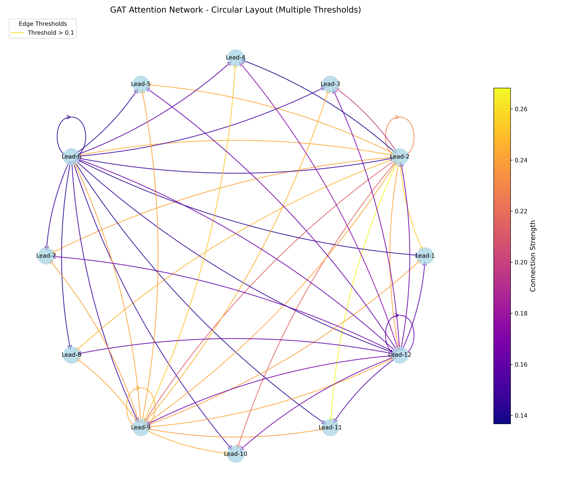

# FHGNet: A Feature-Centric Hierarchical Network with Graph Attention Layer for Supraventricular Tachycardia Classification

## Overview

This repository contains the official implementation of FHGNet(FHGNet: A Feature-Centric Hierarchical Network with Graph Attention Layer for Supraventricular Tachycardia Classification), a deep learning framework for automated electrocardiogram (ECG) classification with a focus on distinguishing ventricular tachycardia (VT) from supraventricular tachycardia (SVT). The model integrates multi-lead spatio-temporal features and follows clinical diagnostic workflows to achieve high accuracy and interpretability.

## Key Innovations

### 1. Clinically-Informed Input Representation
- R-peak detection using Pan-Tompkins algorithm for physiologically accurate heartbeat segmentation
- Adaptive patch length optimization based on RR interval distribution
- Asymmetric windowing to capture complete P-QRS-T complexes

### 2. Dual-Branch Feature Decoupling
- **Morphology Branch (CNN)**: Extracts intra-beat morphological characteristics using multi-scale 1D convolutional layers
- **Rhythm Branch (Transformer)**: Models inter-beat rhythmic patterns and long-range dependencies across consecutive heartbeats
- Parallel architecture mimics clinical diagnostic approach of analyzing waveform morphology and cardiac rhythm separately

### 3. Relational Multi-Lead Fusion
- Graph Attention Network (GAT) dynamically learns spatial dependencies between ECG leads
- Explicit modeling of inter-lead relationships beyond conventional concatenation
- Adaptive weighting mechanism for multi-lead feature integration

### 4. Hierarchical Diagnostic Reasoning
- Two-stage classifier design: Stage 1 screens normal vs abnormal, Stage 2 classifies abnormal subtypes
- Mirrors clinical decision-making workflow for improved minority class detection
- Confidence-based rejection mechanism for uncertain predictions





## Repository Structure

```
MORTIS/
├── checkpoints/              # Model checkpoints and results
│   ├── best_model.pth       # Trained model weight will be stored here
├── configs.py               # Configuration parameters
├── data/                    # Data loading and preprocessing
│   ├── __init__.py
│   ├── augmentation.py     # Data augmentation strategies
│   ├── data_factory.py     # Main data pipeline
│   ├── data_loader.py      # Dataset loaders
│   ├── datasets.py         # Dataset classes
│   ├── preprocessing.py    # Signal preprocessing (wavelet, filtering)
│   ├── r_wave_loader.py    # R-peak detection utilities
│   ├── rpeak_utils.py      # R-peak analysis tools
│   ├── smote.py           # SMOTE oversampling
│   └── weight.py          # Class weight calculation
├── layers/                  # Neural network layers
│   ├── FANLayer.py         # Frequency-Aware Network layer
│   ├── r_wave_patch_embedding.py
│   ├── r_wave_positional_encoding.py
│   ├── self_attention.py   # Attention mechanisms
│   └── transformer_encoder.py
├── models/                  # Model architectures
│   ├── channel_attention.py
│   ├── model.py            # Main FHGNet model
│   ├── morphology_cnn.py   # CNN branch for morphology
│   └── patch_embedding.py
├── utils/                   # Utility functions
│   ├── loss.py             # Loss functions (BCE, CrossEntropy, Focal)
│   ├── masking.py          # Attention masking utilities
│   ├── metrics.py          # Evaluation metrics
│   └── normalizer.py       # Data normalization
├── train.py                # Training script
├── test.py                 # Testing script
├── requirement.txt         # Python dependencies
└── LICENSE
```

## Installation

### Requirements
- Python 3.8+
- CUDA 11.x or higher (for GPU support)
- PyTorch 2.0+

### Setup

1. Clone the repository:
```bash
git clone https://github.com/your-username/MORTIS.git
cd MORTIS
```

2. Install dependencies:
```bash
pip install -r requirement.txt
```

## Dataset Preparation

### MIT-BIH Supraventricular Arrhythmia Database (SVDB)

1. Download the dataset from PhysioNet:
   - Visit: https://physionet.org/content/svdb/1.0.0/
   - Download all `.dat`, `.hea`, and `.atr` files

2. Organize the data:
```bash
mkdir -p data/mit-bih-svdb
# Place all downloaded files in data/mit-bih-svdb/
```

3. Verify dataset structure:
```
data/mit-bih-svt-svdb/
├── 800.dat
├── 800.hea
├── 800.atr
├── 801.dat
├── 801.hea
├── 801.atr
...
```

## Usage

### Training

```bash
python train.py
```

Key configuration parameters in `configs.py`:
### Testing

```bash
python test.py
```

## Citation

If you use this code or model in your research, please cite:

```bibtex
@article{Ju2026FHGNet,
  author    = {Ju, Xiaoling and Liu, Tong and Luo, Bowen and others},
  title     = {FHGNet: A Feature-Centric Hierarchical Network with Graph Attention Layer for Supraventricular Tachycardia Classification},
  journal   = {Interdisciplinary Sciences: Computational Life Sciences},
  year      = {2026},
  doi       = {10.1007/s12539-025-00802-7},
  url       = {https://doi.org/10.1007/s12539-025-00802-7}
}
```

## License

This project is licensed under the terms specified in the LICENSE file.

## Contact

For questions or issues, please open an issue on GitHub or contact the authors.


